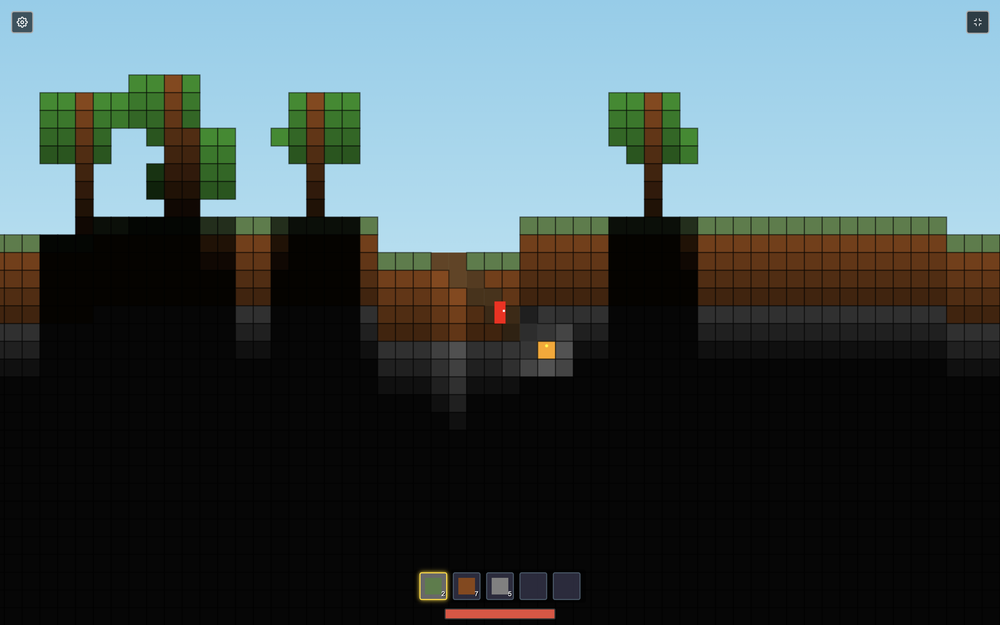
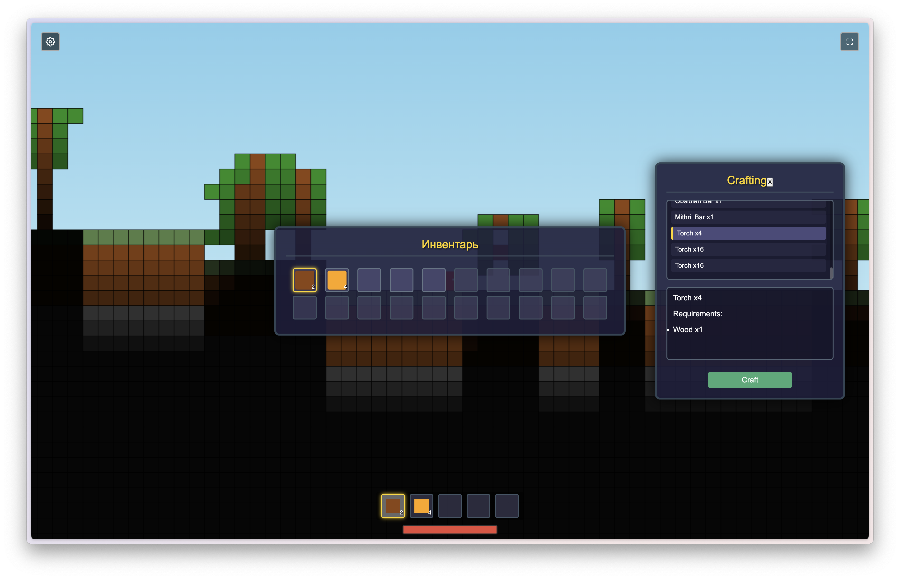

# 🏔️ Mining Empire Enhanced

[](https://mining-empire-enhanced.netlify.app/)
[](https://developer.mozilla.org/en-US/docs/Web/JavaScript)
[](LICENSE)

**A captivating 2D sandbox adventure game inspired by Terraria, where you build, mine, and explore an infinite underground world!**



---

## 🌟 Features

### 🛠️ Core Gameplay
- **Extensive Mining System** - Dig deep underground to discover rare ores and materials
- **Advanced Crafting** - Create tools, weapons, and structures from collected resources
- **Base Building** - Construct elaborate underground and surface bases
- **Exploration** - Venture through diverse biomes and hidden cave systems

> 📸 **Add feature showcase here**: `screenshots/features-grid.png` - 2x2 grid showing mining, crafting, building, and exploration

### 🎨 Visual Experience
- **Pixel Art Graphics** - Beautiful hand-crafted 2D sprites and animations
- **Dynamic Lighting** - Atmospheric lighting effects in caves and buildings
- **Parallax Backgrounds** - Immersive multi-layered environments

---

## 🎮 How to Play

### Getting Started
1. **Mine Resources** - Use your pickaxe to gather stone, ores, and other materials
2. **Craft Tools** - Open the crafting menu to create better equipment
3. **Build Shelter** - Construct a base to protect yourself from enemies
4. **Explore Deeper** - Venture into dangerous depths for rare treasures

> 📸 **Add tutorial screenshots here**: `screenshots/tutorial/` folder with:
> - `getting-started.png` - Character starting area
> - `crafting-menu.png` - Crafting interface screenshot
> - `first-base.png` - Example of a starter base

### Controls
- **WASD** - Move character
- **Mouse** - Interact with blocks and items
- **E** - Open inventory
- **C** - Open crafting menu

---

## 🏗️ Building & Crafting

### Resource Types
- **🪨 Stone & Dirt** - Basic building materials
- **⛏️ Ores** - Iron, Gold, Diamond for advanced tools
- **🌳 Wood** - From surface trees for construction
- **💎 Gems** - Rare materials for magical items

> 📸 **Add resource showcase here**: `screenshots/resources.png` - Grid showing different resource types

### Crafting System
Create everything from simple tools to complex machinery:
- **Tools** - Pickaxes, shovels, axes
- **Weapons** - Swords, bows, magical staffs
- **Building Materials** - Processed blocks and decorative items
- **Furniture** - Chests, workbenches, decorative pieces



---

## 🌍 World Generation

### Biomes
- **🏔️ Surface** - Rolling hills with trees and grass
- **🕳️ Underground** - Vast cave networks with ore veins
- **🌋 Deep Caverns** - Dangerous depths with rare resources
- **🏛️ Ruins** - Ancient structures with hidden treasures

> 📸 **Add biome showcase here**: `screenshots/biomes/` folder with:
> - `surface.png` - Surface world view
> - `caves.png` - Underground cave systems
> - `deep-caverns.png` - Deep underground areas

### Procedural Generation
Each world is unique with:
- Randomly generated terrain
- Scattered ore deposits
- Hidden cave systems
- Ancient ruins and treasures

---

## 🚀 Getting Started

### Play Online
Visit [mining-empire-enhanced.netlify.app](https://mining-empire-enhanced.netlify.app/) to play instantly in your browser!

### Local Development
```bash
# Clone the repository
git clone https://github.com/AndreyShyshkin/Mining-Empire-Enhanced.git

# Navigate to project directory
cd Mining-Empire-Enhanced

# Open index.html in your browser or use a local server
# For development, use Live Server extension in VS Code
```

> 📸 **Add development screenshot here**: `screenshots/development.png` - Code editor or development setup

---

## 🛠️ Technology Stack

- **JavaScript** - Core game logic and mechanics
- **HTML5 Canvas** - 2D rendering and graphics
- **CSS3** - UI styling and responsive design

---

## 🎯 Roadmap

### Upcoming Features
- [ ] **Advanced Magic System** - Spells and enchantments
- [ ] **Weather System** - Dynamic weather affecting gameplay
- [ ] **NPCs & Trading** - Villages and merchant interactions
- [ ] **Achievement System** - Unlock rewards for milestones
- [ ] **Mobile Support** - Touch controls for mobile devices

---

## 📄 License

This project is licensed under the MIT License - see the [LICENSE](LICENSE) file for details.

---

## 👏 Acknowledgments

- Inspired by **Terraria** and other sandbox adventure games
- Pixel art resources from various indie game asset creators

---

<div align="center">

**⭐ Star this repository if you enjoyed Mining Empire Enhanced! ⭐**

Made with ❤️ by [AndreyShyshkin](https://github.com/AndreyShyshkin)

</div>
